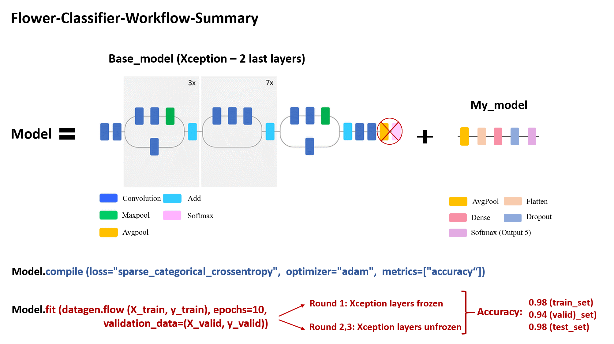

# Flower classification using a Convolutional Neural Network (CNN)

* **Description**: In this image classification project, I trained a CNN model capable of classifying 5 types of flowers with a 90% accuracy by using **transfer learning** and **data augmentation**.

## Code and Resources Used

**Python Version**: 3.7

**Packages**: pandas, numpy, random, os, cv2, pathlib, PIL, sklearn, matplotlib, seaborn, tensorflow (2.3.1) and keras (2.4.0).

## 1. Load  and inspect the data:

   * Create the path list using **glob**
    
   * Create a dict with the list of paths for each label, and a dict with the lables associated to a number (labeling)
    
   * Using the dict get the np.array format and resize all pictures (**cv2**) to get **X** and use the label-dict to get **y**
   
## 2. **Split** the data to create test, train and valid sets.

## 3. **Transer Learning**. 

 * Get a good candidate for this use case. Xception.
 * Preprocess the data sets.
 * Create a base model using the **Xception** model and add our own end_model.
 * Train the model including a ImageDataGenerator object to include **data augmentation** features.
    
     * First, train the model with all Xception model layers frozen.
     * Second, unfreeze the layers to achieve higher accuracy.
     
  
 
 ## 4. Model Evaluation.
 
 
